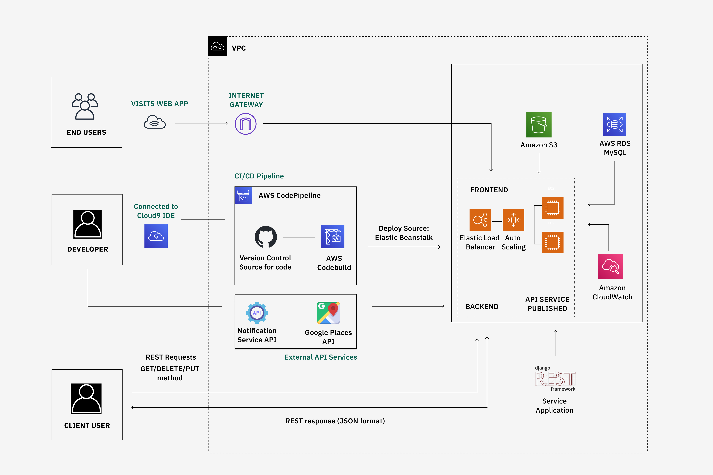

# Cloud-Based Event Application

## Project Overview

The aim of this project was to create a cloud-based web application that enables users to create and register for events. The application was developed using Django, HTML, CSS, and JavaScript. A service application accessible by RESTful API was built with the Django REST framework for the consumption of any client application best needed for its purpose. AWS RDS MySQL was used as the database and AWS S3 Bucket for cloud storage. The application also consumes web services, such as the Google Places API for location auto-suggestions when creating an event, a notification web service for sending notifications to event creators, and a book management system API that lists out books on the client application.

## Key Features

- **Event Creation and Registration**: Users can easily create and register for events through the web application.

- **Django REST API**: A RESTful API is available for client applications to interact with the service application.

- **AWS RDS Database**: Utilizes AWS RDS MySQL for efficient and scalable database storage.

- **AWS S3 Cloud Storage**: Securely stores application data in AWS S3 buckets.

- **Integration with External Services**: The application integrates with external services such as the Google Places API for location suggestions, a service application for sending notifications, and a book management system API.

- **Elastic Beanstalk and CodePipeline**: It uses AWS Elastic Beanstalk for deployment and scaling.

- **AWS CodePipeline**: Continuous integration, and delivery.
  

## Functional Requirements of Service Application
- **Data Retrieval**: The API retrieves event data from the application database based on the requested data type (e.g. event name, description, location, time, and featured image).

- **Data Processing**: The API puts requests in a queue, processes them, and retrieves the requested data of the client user from the database.

- **Data Format**:The data is returned to the client in the appropriate format JSON format.

- **Request Methods**: The API allows for GET, POST, PUT, and DELETE request methods. This will enable a client user to get, create, update, and delete event data as needed.

## Technologies Used

- **Frontend**: HTML, CSS, JavaScript

- **Backend**: Django

- **Database**: AWS RDS MySQL

- **Cloud Storage**: AWS S3

- **API Development**: Django REST framework

  Here is the architectural diagram for the application:

## Deployment

- **Web Application**: The cloud-based event application is accessible through a web browser after deployment.

- **Service Application**: The service application is accessible via an endpoint URL.

## Getting Started

To get started with the project, follow these steps:

1. Clone the repository to your local machine.

2. Set up your AWS account and configure your credentials.

3. Install the required dependencies for the project.

4. Configure S3 access key details, AWS RDS, and Elastic Beanstalk.
